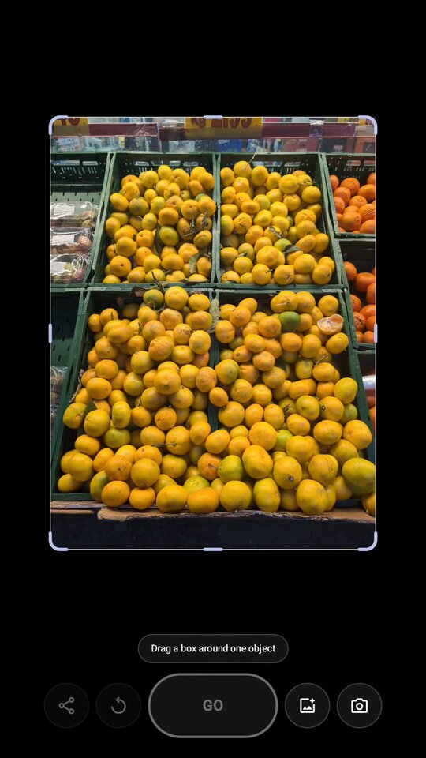
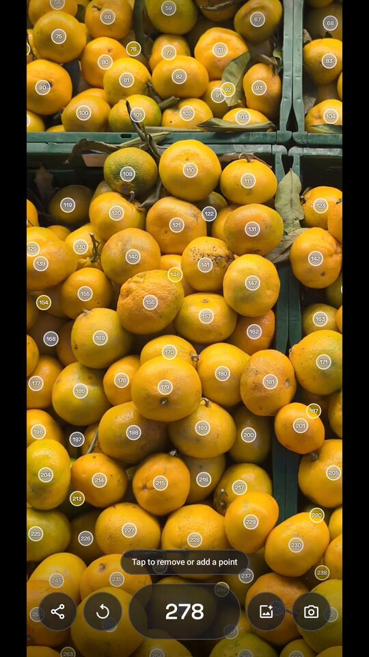

<p align="center">
  
</p>

<h1 align="center">how many?</h1>

<p align="center">
  An Android app that counts objects in a photo, fully offline and open source.
</p>

<p align="center">
  
  
  
  
  <a href="LICENSE"></a>
</p>

| Take a Photo | Mark one Object | Get the Count | Verify Results |
|:---:|:---:|:---:|:---:|
|  |  |  |  |

A stack of pipes, a crowd of people, a tray of pills: take a photo, draw a box around
one of the things you want to count, and how many? finds and marks every object that
looks like it. Everything runs on your phone. The app has no internet permission, so
no photo ever leaves the device.

<p align="center">
  <a href="#install">Install</a> ·
  <a href="#usage">Usage</a> ·
  <a href="#accuracy">Accuracy</a> ·
  <a href="#building">Building</a> ·
  <a href="#contributing">Contributing</a> ·
  <a href="#acknowledgements">Acknowledgements</a> ·
  <a href="#license">License</a>
</p>

## Install

<p align="center">
  
  
  <br>
  <sub>Coming soon to Google Play and F-Droid.</sub>
</p>

Until then, you can [build it yourself](#building).

## Usage

1. Take a photo or pick one from your gallery.
2. Drag a box around one of the objects you want to count.
3. Tap Count. how many? marks every object that looks like it.
4. Check the result: drag the edges to count only part of the photo, tap a point to
   remove a wrong one, or tap an object to add one that was missed.

Counting takes a few seconds and works best when the objects are clearly visible and
not too small in the photo.

## Accuracy

We measure how far the counts are off on two benchmarks, with one marked object as in
the app: 100 images from the [FSC-147](https://github.com/cvlab-stonybrook/LearningToCountEverything)
test set, and 85 of our own phone photos.

| Benchmark | Exact | Within 10% | Mean relative error |
|---|---:|---:|---:|
| FSC-147 | 27% | 66% | 11% |
| Our photos | 32% | 59% | 28% |

The full results are in [`model/results/`](model/results). That's why the last step is
checking the result: a few taps usually fix the count.

## Building

You need JDK 21 and the Android SDK. The build downloads the counting model from this
repository's releases. With a phone attached via USB debugging:

```sh
cd android
./gradlew installRelease
```

[`model/`](model) exports the counting model (`uv run modal run export.py`, needs
[uv](https://docs.astral.sh/uv/) and a [Modal](https://modal.com) account) and holds the
benchmark: `uv run benchmark.py`. See [`AGENTS.md`](AGENTS.md) for all commands.

## Contributing

Contributions are welcome, from bug reports and feature requests to pull requests.
Photos where how many? counts badly are especially helpful: [open an issue](https://github.com/EiSiMo/howmany/issues)
and describe what you tried to count.

## Acknowledgements

how many? stands on the shoulders of others' work:

- [GeCo2](https://github.com/jerpelhan/GECO2) by Jer Pelhan, Alan Lukežič and Matej Kristan
  is the few-shot counting model that does the actual counting (MIT).
- [SAM 2](https://github.com/facebookresearch/sam2) by Meta, whose image encoder GeCo2
  builds on (Apache 2.0).
- [FSC-147](https://github.com/cvlab-stonybrook/LearningToCountEverything) by Viresh Ranjan
  et al., the dataset GeCo2 learned to count on and our benchmark.
- [ONNX Runtime](https://onnxruntime.ai) by Microsoft runs the model on the phone (MIT).
- [Space Grotesk](https://github.com/floriankarsten/space-grotesk) by Florian Karsten is
  the typeface of the count (OFL).

## License

[MIT](LICENSE). The app's about page lists the licenses of everything it bundles.
